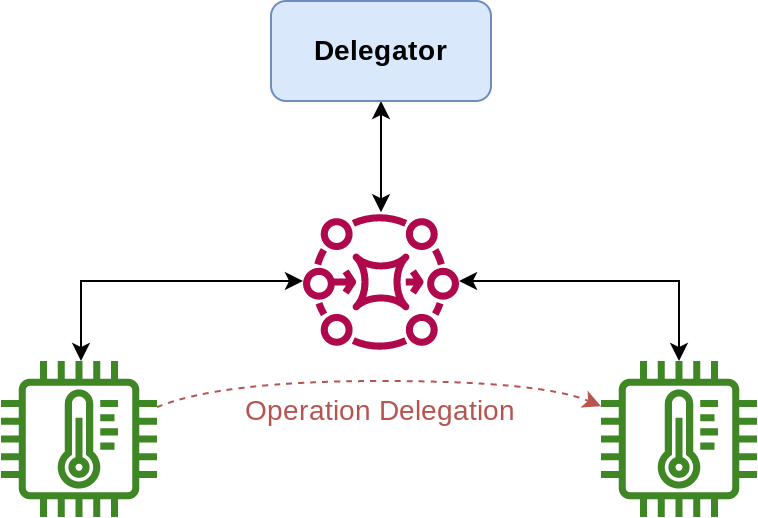
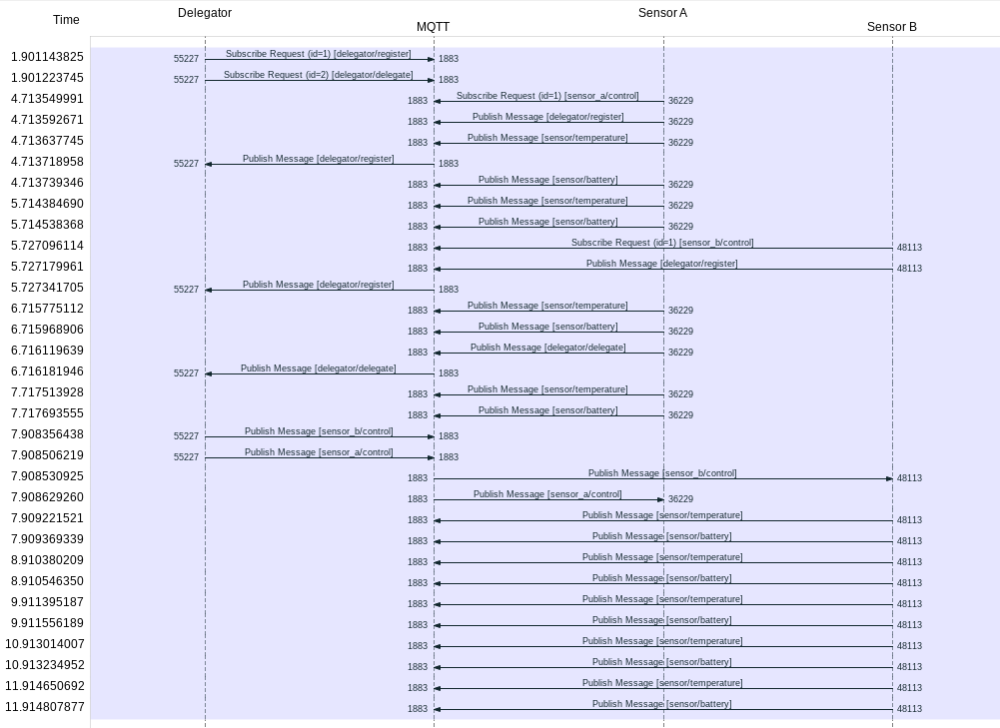

# IoT Delegation

This repository contains the Proof of Concept (PoC) from the paper named "Dynamic Delegation-based Privacy Preserving in
IoT Architectures".

## Setup

This PoC implements a simple scenario where a Sensor A reaches a critical
battery level and delegates the temperature measure task to Sensor B
(as depicted in the following figure).



## Deployment

The Poc was developed using python and instantiated using docker.
In the repository, you can find a docker-compose file.
To run the PoC simple execute the following command:

```
docker-compose up --build --force-recreate --no-deps
```

[MQTT Explorer](http://mqtt-explorer.com/) can be used to analyse the output of the sensor devices.

The messages flow can also be analysed using [Wireshark](https://www.wireshark.org/) using the following filter:

```
mqtt.topic=="sensor/temperature" or mqtt.topic=="sensor/battery" or mqtt.topic=="sensor_a/control" or mqtt.topic=="sensor_b/control" or mqtt.topic=="delegator/register" or mqtt.topic=="delegator/delegate"
```

The resulting flow chart is the one following.




The following command can be used to clean the PoC:

```
docker system prune -a
```

## Authors

* **[Catarina Silva](https://github.com/catarinaacsilva)**

## License

This project is licensed under the MIT License - see the [LICENSE](LICENSE) file for details.
